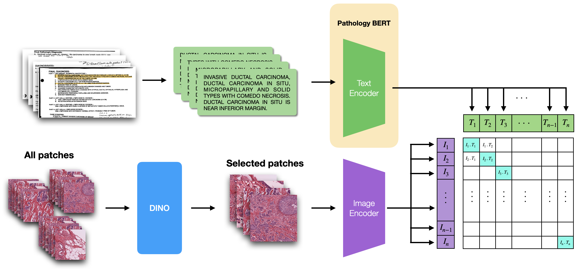
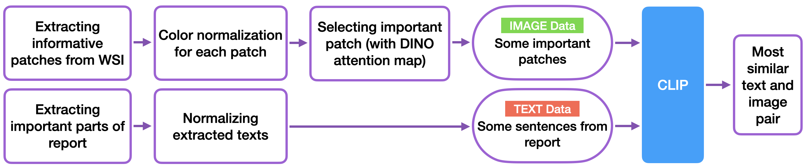
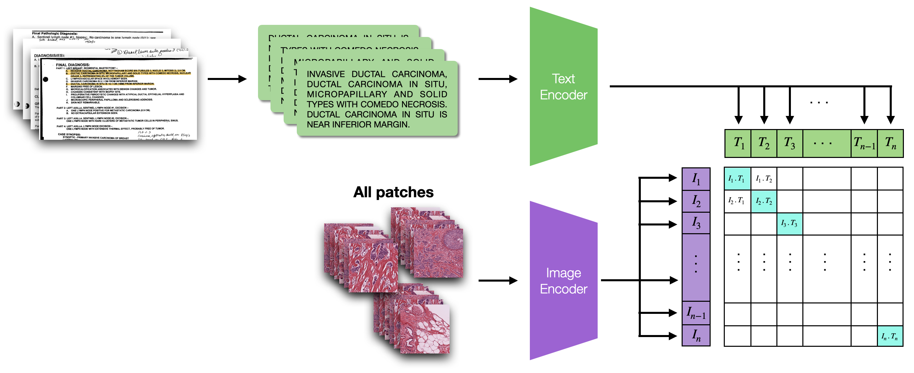

# CLIPath
**CLIP for Whole Slide Image & Report**

<b>مدل یادگیری ماشین کلیپ برای آموزش توام متن گزارش و تصویر WSI</b>

<figure>
  

    
  

  
تصویر 1 - مدل ارائه شده

</figure>

<figure>
  

    
  

  
تصویر 2 - پایپلاین پردازشی

</figure>
 

پایپلاین پردازشی زمان آزمایش به این صورت می‌باشد که دو پایپلاین موازی فعالیت می‌کنند که به ترتیب عبارت اند از پایپلاین پردازشی تصویر و پایپلاین پردازشی متن. (تصویر ۲)
در ابتدا می‌بایست یک تصویر WSI انتخاب شده و گزارش مربوط به آن نیز مشخص شود. سپس تصویر و گزارش به پایپلاین ها وارد می‌شوند.
 
پایپلاین پردازش تصویر ابتدا تصویر WSI را به قطعات کوچکی می‌شکند که حاوی اطلاعات مفید باشند و قطعاتی که اطلاعات مفیدی نداشته باشند حذف می‌شوند. (توضیحات بیشتر در <a href="download and image-patching">بخش قطعه‌بندی تصویر</a>) سپس قطعات وارد بخش نرمال سازی می‌شود که متناسب با یک تصویر مرجع نرمال سازی رنگی برای آن‌ها انجام می‌شود. (توضیحات بیشتر در <a href="color-normalization">بخش نرمال‌سازی تصویر</a>)  پس از آن تصاویر نرمال شده را به مدل DINO می‌دهیم و براساس یک ترشلد بر روی نقشه توجه، تصاویری که نقشه توجه با مقادیر بالاتری داشته باشند به عنوان تصاویر مهم انتخاب می‌شوند. تصاویر انتخاب شده به عنوان ورودی در کنار متن انتخاب شده در پایپلاین متنی به مدل کلیپ داده می‌شوند. (توضیحات بیشتر در <a href="model">بخش مدل</a>)
 
پایپلاین پردازش متن ابتدا گزارش مربوط به تصویر WSI را پردازش کرده و بخش Final Diagnosis را به متخصص نشان داده و متخصص بخش ارزشمند آن را در حد ۲ تا ۳ جمله انتخاب می‌کند. (یا خلاصه می‌کند.) و به عنوان متن انتخابی به مدل کلیپ داده می‌شود. (توضیحات بیشتر در <a href="text-preperation">بخش پردازش متن</a>)
 
<figure>
  

    
  

  
تصویر 3 - مدل پایه

</figure>

 
در مدل پایه از مدل اصلی کلیپ استفاده شده است که در تصویر ۳ قابل شماهده است. اما در مدل اصلی از
مدل کلیپ با جایگزینی مدل زبانی (تصویر ۱) استفاده شده است. برای مدل زبانی از <a href="https://arxiv.org/pdf/2205.06885.pdf">pathology BERT</a> استفاده شده که به صورت خاص روی گزارش‌های پاتولوژی آموزش دیده است و نتایج مناسبی را در این بخش ارائه کرده است. همچنین به عنوان تصاویر ورودی همان طور که در پایپلاین پردازشی توضیح داده شده است، به عنوان تصاویری ورودی، تصاویری که از ترشلد مشخص شده توجه بیشتری داشته باشند (در خروجی مدل DINO) به عنوان تصاویر ورودی انتخاب می شوند که در کنار بخش انتخاب شده از متن گزارش، به عنوان ورودی های مدل کلیپ به شبکه داده می شوند.

 

اعضای گروه:

محمدحسین موثقی‌نیا  

رضا عباسی  

حسین جعفری‌نیا  

حسن علیخانی  

مهدی شادروی  

علی سلمانی  

