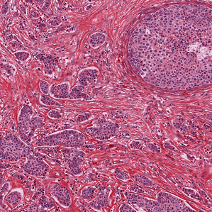
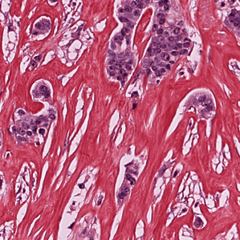
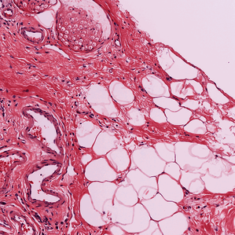
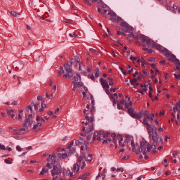

<h2 style="direction:rtl">نرمال‌سازی پچ‌های تصویر</h2>

	در این بخش با استفاده از نرم افزار <a href="https://github.com/Peter554/StainTools">staintools</a> نرمال‌سازی رنگی بر روی تمامی پچ‌های تصویر انجام شده است. این نرم افزار به این صورت کار می کند که یک تصویر را به عنوان مرجع دریافت کرده و متناسب با آن بقیه تصاویر را نرمال می کند. این نرمال سازی برای رنگ‌های تصویر است؛ به این معنی که ترکیب رنگی ای که بعد از نرمال سازی به دست می آید بسیار مشابه تصویر مرجع است. هدف از این کار این است که، مدلی که بر روی این تصاویر آموزش می بیند، تلاش کند ویژگی های اصلی تصویر شامل تغییر شکل های مرتبط با هسته سلول ها و مواردی از این دست را استخراج کند؛ چرا که اگر این نرمال سازی صورت نگیرد، ممکن است مدل یادگیرنده نسبت به تغییرات رنگ در تصاویر مختلف حساس شده و به اشتباه ویژگی هایی غیرمرتبط با وظیفه اصلی یادبگیرد و هرچند ممکن است نتایج خوبی داشته باشد ولی صرفا تاثیر شباهت این ویژگی غیرمرتبط در کلاس های مختلف است و اصطلاحا به آن تاثیر دسته (batch effect) می گویند که به این معنی است که مدل به خوبی ویژگی ها را استخراج نکرده است و صرفا ویژگی هایی را یادگرفته که کمک کرده تا تصمیم درستی بگیرد و براساس یک ویژگی غیرزیستی موجود در تصاویر بوده است از جمله رنگ و … که به این ترتیب اگر مجموعه دادگان تغییر کند؛ عملکرد مدل به شدت کاهش پیدا می کند. به زبانی دیگر مدل به خوبی تعمیم پیدا نکرده است.

<h3>چند مثال:</h3>

تصویر ۱ (ورودی): [ابعاد واقعی تصویر: ۳۰۷۲×۳۰۷۲]

تصویر ۱ (نرمال شده): [ابعاد واقعی تصویر: ۳۰۷۲×۳۰۷۲]

تصویر ۲ (ورودی): [ابعاد واقعی تصویر: ۱۰۲۴×۱۰۲۴]

تصویر ۲ (نرمال شده): [ابعاد واقعی تصویر: ۱۰۲۴×۱۰۲۴]

تصویر ۳ (ورودی): [ابعاد واقعی تصویر: ۳۰۷۲×۳۰۷۲]

تصویر ۳ (نرمال شده): [ابعاد واقعی تصویر: ۳۰۷۲×۳۰۷۲]

تصویر ۴ (ورودی): [ابعاد واقعی تصویر: ۱۰۲۴×۱۰۲۴]

تصویر ۴ (نرمال شده): [ابعاد واقعی تصویر: ۱۰۲۴×۱۰۲۴]

