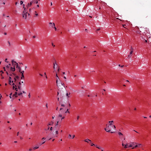
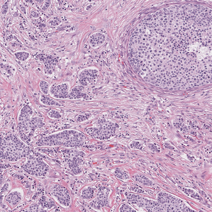
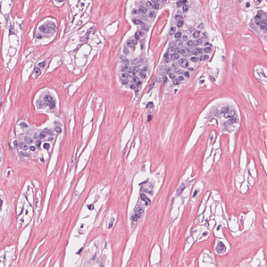
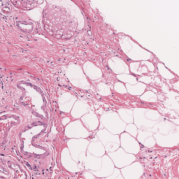
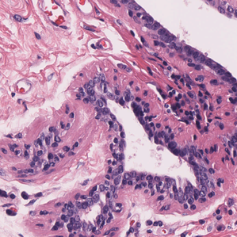

<h2 style="direction:rtl">نرمال‌سازی پچ‌های تصویر</h2>

ابتدا تعدادی محتوی آموزشی
که آشنایی ابتدایی در رابطه با بافت ریه و پستان می‌دهند مشاهده شد سپس با استفاده از نرم افزار
PMA.start
بررسی چشمی
۹۰ تصویر
WSI
 تصادفی یکنواخت سالم ریه و 
۳۰ تصویر
WSI
تصادفی یکنواخت سالم پستان جهت آشنایی با فضای بافتی مجموعه داده TCGA انجام شد. در نهایت 
۳ تصویر
WSI
انتخاب شد و قطعه قطعه شده و بهترین آن ها که نماینده خوبی از کلیه بافت های پستان است و کیفیت های لازم برای عکس مرجع نرمال سازی به روش مطرح شده در <a href="https://arxiv.org/abs/2203.12204">این مقاله</a>
را دارد انتخاب شد. چنین قطعه ای باید حاوی ویژگی های زیر باشد:

<ul  style="direction:rtl">
<li>بخش پس‌زمینه و سفید کمی داشته باشد.</li>
<li>بخش های مختلف بافت سینه مانند gland و یا بافت میانی را داشته باشد باشد.</li>
<li>رنگ آن میانگین کیفی از رنگ WSI ها باشد.</li>
<li>تراکم تعداد هسته های موجود در آن میانگین چشمی تراکم تعداد هسته های موجود در WSI ها باشد.</li>
</ul>

	 در نهایت نرمال‌سازی رنگی به کمک نرم‌افزار <a href="https://github.com/Peter554/StainTools">staintools</a> که مبتنی بر <a href="https://pubmed.ncbi.nlm.nih.gov/27164577/">این مقاله</a> پیاده سازی شد است؛ انجام گرفته است. 
	این نرم افزار به این صورت کار می کند که یک تصویر را به عنوان مرجع دریافت کرده و متناسب با آن بقیه تصاویر را نرمال می کند. این نرمال سازی برای رنگ‌های تصویر است؛ به این معنی که ترکیب رنگی ای که بعد از نرمال سازی به دست می آید بسیار مشابه تصویر مرجع است. هدف از این کار این است که، مدلی که بر روی این تصاویر آموزش می بیند، تلاش کند ویژگی های اصلی تصویر شامل تغییر شکل های مرتبط با هسته سلول ها و مواردی از این دست را استخراج کند؛ چرا که اگر این نرمال سازی صورت نگیرد، ممکن است مدل یادگیرنده نسبت به تغییرات رنگ در تصاویر مختلف حساس شده و به اشتباه ویژگی هایی غیرمرتبط با وظیفه اصلی یادبگیرد و هرچند ممکن است نتایج خوبی داشته باشد ولی صرفا تاثیر شباهت این ویژگی غیرمرتبط در کلاس های مختلف است و اصطلاحا به آن تاثیر دسته (batch effect) می گویند که به این معنی است که مدل به خوبی ویژگی ها را استخراج نکرده است و صرفا ویژگی هایی را یادگرفته که کمک کرده تا تصمیم درستی بگیرد و براساس یک ویژگی غیرزیستی موجود در تصاویر بوده است از جمله رنگ و … که به این ترتیب اگر مجموعه دادگان تغییر کند؛ عملکرد مدل به شدت کاهش پیدا می کند. به زبانی دیگر مدل به خوبی تعمیم پیدا نکرده است.

تصویر مرجع برای نرمال‌سازی رنگ:

<h2 align="center">چند مثال:</h2>

تصویر اولیه             |  تصویر نرمال شده
:-------------------------:|:-------------------------:
3072×3072  |  3072×3072
1024×1024  |  1024×1024
3072×3072  |  3072×3072
1024×1024  |  1024×1024
