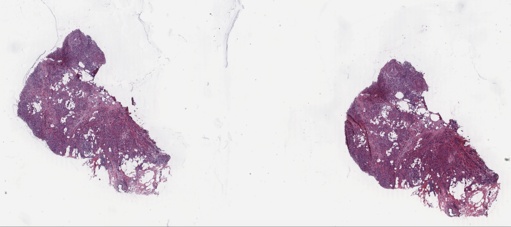
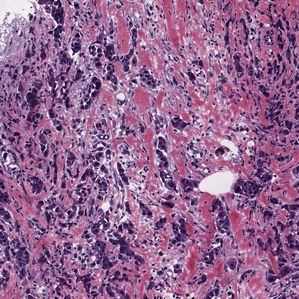
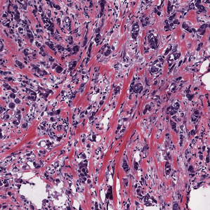

<h2 dir="rtl"> آماده‌سازی تصاویر </h2>

داده‌ی مورد نیاز برای پروژه از دو قسمت متن گزارش و تصاویر مرتبط با آن گزارش، تشکیل شده‌است. برای استفاده و دانلود تصاویر نیاز است UUID هر کدام از تصاویر را پیدا کنیم. برای این کار manifest  کامل دیتاست مورد نظر را دانلود می‌کنیم که شامل UUID، نام فایل، سایز فایل و موارد دیگر است. از روی نام فایل آن‌هایی که فرمت svs دارند و جزو گزارش‌های انتخاب‌شده هستند را فیلتر می‌کنیم. نهایتا یک فایل manifest خواهیم داشت که تمام موارد آن باید دانلود و پردازش شود.

با توجه به این ‌که تصاویر موردنظر به صورت مستقیم از منبع انتخاب شده قابلیت دانلود شدن را ندارند، نیاز است برنامه‌ی  <a href="https://github.com/NCI-GDC/gdc-client">gdc client</a> نصب شود. این برنامه در دو نسخه‌ی دارای محیط گرافیکی و بدون محیط گرافیکی ارائه می‌شود که با توجه به فرآیند انجام کار که در colab اجرا می‌شود، نسخه‌ی بدون محیط گرافیکی نصب شده‌است. این برنامه UUID را به عنوان ورودی گرفته و فایل مورد نظر را دانلود و ذخیره می‌کند. با توجه به فایل manifest ساخته شده، فایل‌ها را یکی یکی دانلود می‌کنیم. مجموع حجم فایل‌های دانلود شده حدودا ۶۰ گیگابایت است.

برای خواندن تصاویر با فرمت svs، از کتابخانه‌ی <a href="https://github.com/openslide/openslide-python">openslide </a>  استفاده کرده‌ایم. این کتابخانه تابعی را معرفی می‌کند که با فراخوانی آن می‌توانیم بخشی از تصویر را در پایتون برای پردازش کردن، بارگذاری کنیم. امکان بارگذاری کامل تصویر با توجه به حجم زیاد آن و محدودیت حافظه‌ی colab، وجود ندارد. 

با توجه به هدف پروژه، نیاز است تصاویر دانلود شده به صورت پچ‌هایی با سایز کمتر تبدیل شوند. برای این کار روی عکس در جهت سطری و در جهت ستونی با گام‌های ۱۰۲۴ پیکسلی حرکت می‌کنیم و ناحیه انتخاب شده را با استفاده از openslide می‌خوانیم. با این کار عکس مورد نظر به پچ‌هایی با سایز ۱۰۲۴ در ۱۰۲۴ پیکسل تبدیل می‌شود. از آنجایی که بعضی از این به اصطلاح پچ‌‌‌‌ها دارای اطلاعات مفید نیستند یا به زبانی دیگر دارای قسمت زیادی از بافت نیستند، می بایست از دادگان حذف شوند.
برای این منظور راه اولیه ای که استفاده شد این بود که از الگوریتم یافتن پویای یک ترشلد برای این کار استفاده کنیم که تحت عنوان otsu ارائه شده است. به این صورت که این الگوریتم با استفاده از پیدا کردن یک ترشلد مناسب برای تصویر، تلاش می کند که پس‌زمینه و پیش‌زمینه را از هم جدا کند و تمام پیکسل‌های تصویر را به دو دسته صفر و یک تقسیم کند. با اجرای این روش در بسیاری از تصاویر که درصد پس‌زمینه بسیار بالا بوده است، دچار خطا شد و تقریبا کل پس‌زمینه را نیز به عنوان بافت در نظر گرفته بود. به همین جهت به جای این الگورتیم از یک ترشلد دستی استفاده شده است به این معنی که روی تصویر بررسی شده است که اگر بیش از ۹۰ درصد پیکسل‌های تصویر عددی بزرگتر از ۲۴۰ داشته باشند به این معنی است که تصویر حاوی داده مفیدی از بافت نیست و اکثرا پس‌زمینه است و این پچ حذف خواهد شد. به همین ترتیب تمامی تصاویر بررسی شده و پچ‌هایی که در این شرط صدق کنند، حذف می‌‌‌‌‌‌‌‌‌‌‌‌‌‌‌شوند. (همین فرآیند برای تصاویر با اندازه های ۲۰۴۸ و ۳۰۷۲ نیز تکرار می شود.)

<h3 dir="rtl">مثال</h3>

 تصویر کامل 

 

نمونه‌ای از پچ‌ها

 

