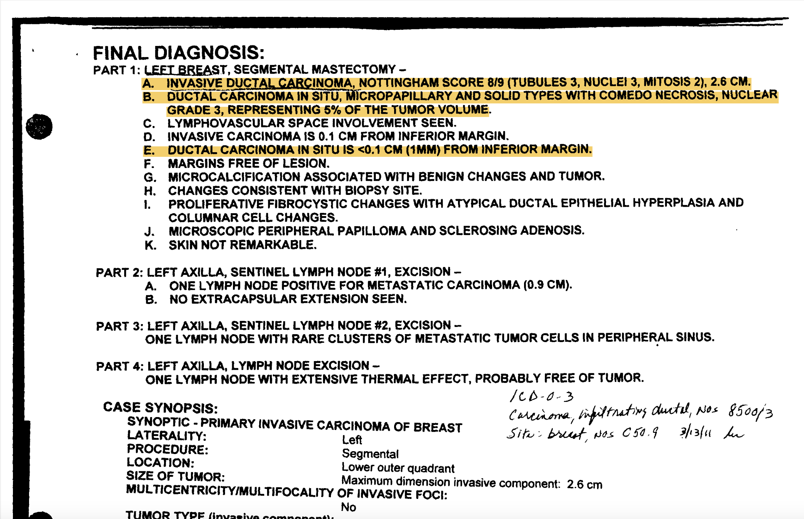

<h2 style="direction:rtl;">استخراج قسمت مهم گزارش</h2>

ابتدا تمامی
pdf
های گزارش های آسیب شناسی مربوط به سرطان پستان
(BRCA)
از سایت
TCGA
با استفاده از نرم افزار فراهم شده توسط خودشان دانلود شده (۱۱۰۰ فایل) سپس گزارش هایی که به این حالت هستند که بخش
Diagnosis
 دارند و بخش
Diagnosis
آن ها هم چندین بخش مختلف دارد انتخاب شد.
 
علت این موضوع این است که گزارش های آسیب شناسی ساختار یکسانی ندارند و بعضی به صورت متنی بعضی به صورت جدول هستند بعضی به توضیحاتی کمی و بعضی به توضیحات بسیار بیشتری بسنده کرده اند. در نتیجه ما که برای آموزش مناسب مدل نیاز به ساختار یکسان داریم از این ساختار که درصد بیشتری از 
pdf
ها را تشکیل میداد استفاده کردیم.
 
از بین این لیست از
pdf
پنجاه نمونه با استفاده از توزیع تصادفی یکنواخت گرفته شد.
از بین پنجاه نمونه انتخاب شده بخشی انتخابی وضعیت تهاجمی بودن یا نبودن
milk duct
و
milk lobule
ها به همراه توضیحات مرتبط با هر کدام انتخاب شد.
 
به طور کلی در این زمینه سرطان پستان می‌تواند حالات زیر را داشته باشد:
 
DCIS (Ductal Carcinoma In Situ):
حضور سلول های غیر عادی در
milk duct
ها
 
LCIS (Lobular Carcinoma In Situ):
حضور سلول های غیر عادی در
milk lobule
ها
 
IDC (Invasive Ductal Carcinoma):
حضور سلول های تهاجمی در
milk duct
ها
 
ILC (Invasive Lobular Carcinoma):
حضور سلول های تهاجمی در
milk lobule
ها
 
بخش گفته شده از هر پنجاه
pdf
توسط دو نفر از اعضای گروه استخراج شد و در یک جلسه تک تک موارد توسط هر دو فرد مورد بررسی و رفع اختلاف نظر قرار گرفت و یک متن واحد برای هر گزارش استخراج شد.
بخشی از یک نمونه از این
pdf
ها و متن انتخاب شده متناسب با آن را می‌توان در شکل زیر مشاهده کرد.

 
<h3>مثال:</h3>

برای مثال قسمتی از یکی از گزارش‌ها در تصویر زیر آورده شده است؛ قسمتی که هایلایت شده است، قسمتی است که متن نهایی از آن استخراج شده است و خلاصه شده است:

 

متن استخراج شده: (نتیجه جلسه حل تعارض‌ها)

INVASIVE DUCTAL CARCINOMA, DUCTAL CARCINOMA IN SITU, MICROPAPILLARY AND SOLID TYPES WITH COMEDO NECROSIS. DUCTAL CARCINOMA IN SITU IS NEAR INFERIOR MARGIN

