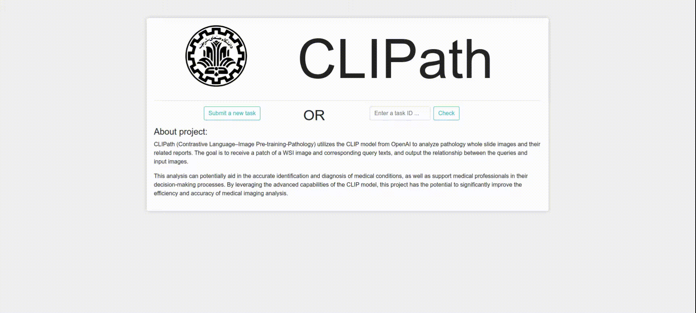

# Online Demo

<hr>
 
<div style="direction:rtl;">
 به منظور نمایش بهتر نحوه عملکرد پروژه CLIPath ، یک وب اپلیکیشن تحت فریموریک <a>جنگو (Django)</a> برای آن در نظر گرفته شده است. این وب اپ در درون خود پایپ لاین کلی مدل های پایه و پیشنهادی جای داده است. 

<figure>
  <p align="center">
    
  </p>
  <p align="center">تصویر 1 - وب اپلیکیشن</p>
</figure>

<br>
نحوه عملکرد این وب اپ به اینصورت است که کاربر، تصویر مورد نظر خود که یک پچ از یک تصویر WSI است را به همراه متن های مورد نظر خود به عنوان کوئری در قسمت های مربوطه وارد کرده و منتظر پاسخ می ماند. وب اپ برای هر آنالیز جدید یک ایدی یکتا درنظر می گیرد و به محض ایجاد یک آنالیز جدید توسط کاربر ، پس از ارسال موفق اطلاعات از طرف کاربر به سرور ، این ایدی یکتا به کاربر نمایش داده خواهد شد. از این ایدی می توان برای بازیابی نتایج در مراحل بعدی استفاده کرد.  
<br>
لازم به توضیح نوع مدل پیشنهادی نیز در لحظه ایجاد آنالیز توسط کاربر قابل انتخاب است و وب اپ با توجه به انتخاب کاربر پایپ لاین مرتبط را برای روی دادگان ورودی اجرای می کند.
نکته قابل توجه دیگر، اجرای خود کار نرمال سازی بر روی تصاویر است ، اپ به صورت خودکار تصاویر و متن وارد شده توسط کاربر را نرمال سازی کرده و سپس آنها را به مدل مربوطه برای انجام آنالیز های بعدی می هد.  
<br>
باتوجه به اینکه انجام برخی از آنالیز ها بسته به نوع ورودی ممکن است طولانی باشد ، نمی توان پایپ لاین های مربوط به هر مدل را به صورت همگام در وب اپ اجرا کرد  و در غیر این صورت ممکن از اجرا با خطا مواجه شود. برای رفع این مشکل ، ترکیب ابزار <a href="https://docs.celeryq.dev/en/stable/">Celey</a> به همراه پایگاه داده <a href="https://redis.com/">Redis</a> استفاده شد که در نتیجه این کار کلیه ی موارد مربوط به پایپ لاین های هر یک دو مدل موجود، کاملا به صورت ناهمگام(asynchronous) اجرا شده و باعث تعامل بهتر و سریعتر کاربر با وب اپ می شود.  
</div>
<hr>
<h3 style="direction:rtl;"> نصب و راه اندازی </h3>
<div style="direction:rtl;">
به منظور نصب و راه اندازی وب اپ به یک سرور لینوکسی با حداقل منابع 2 گیگابایت رم و 2 هسته پردازشی نیاز است. لازم به توضیح است که نیازی به سرور دارای GPU نیست و وب اپ می تواند با CPU نیز اجرا شود. بدیهی است انتخاب سرور با CPU قوی تر زمان پاسخ کمتری را در انجام آنالیز ها به دنبال خواهد داشت. 
<br> 
در ادامه مراحل نصب و راه اندازی CLIPath بر روی سرور مذکور توضیح داده خواهد شد.
</div>
<div style="direction:rtl;">
<h5>1. نصب پیش نیاز ها</h5>
<p>پس از clone کردن repository وارد پوشه <code>web_demo</code> شده و یک محیط مجازی پایتون ایجاد و سپس پیش پیکج های پیشنیاز موجود در فایل <code>requirements.txt</code> را نصب کنید:</p>
</div>

```shell
# clone repository
git clone https://github.com/NLP-Final-Projects/CLIPath.git

# going to web_demo dir and create a virtualenv with python3
cd CLIPath/web_demo
virtiualend venv -p python3

# activate venv and install requirements
source venv/bin/activate
pip install -r requirements.txt
```
<div style="direction:rtl;">
<h5>2. دانلود وزن مدل ها</h5>
<p>همانطور که قبلتر نیز گفته شد این وب اپ هر دومدل بیسلاین و پیشنهادی را شامل می شود. به منظور اجرای این مدل ها لازم است تا وزن های مربوط به هر کدام در حین اجرای پایپ لاین مربوطه در مدل بارگذاری شود. با توجه به حجیم بود فایل های مربوط به وزن مدل ها، این فایل ها در خارج از گیت قرار داده شده اند و قبل از اجرای  وب اپ باید دانلود و در پوشه <code>web_demo/main/data/</code> قرار داده شوند:</p>
</div>

```shell
# working dir: CLIPath/web_demo/

# first install `megatools` for using megadl client to download files from mega.nz
sudo apt install -y megatools
# create data directory
mkdir -p main/data/
# baseline model 
megadl --path main/data/ https://mega.nz/file/yN4lkZxB#UF9ygCUtPf2VsqiCFZyDC2n6YqPHGvt1Qdq6KeVDowo
# CLIPath model
megadl --path main/data/ https://mega.nz/file/vMolxAjK#_Y50RfSRcvOkLLLjmJg0Z6L6wzpj7oEJs2d_oZ1GwtQ

tree main/data
# main/data
# ├── pytorch_model_baseline.bin
# └── pytorch_model_final.bin
```

<div style="direction:rtl;">
<h5>3. نصب و اماده سازی <code>Celery</code> و  <code>Redis</code></h5>
<p>پس از نصب پکیج های مورد نیاز، نیاز است  ابزار های مورد نیاز نیز نصب گردد. همانطور که قبلتر توضیح داده شد این وب اپلیکیشن از <code>Celery</code> و <code>Redis</code> استفاده می کند. مورد اول در بخش قبل نصب شده و اماده است استفاده است لذا در اینجا فقط نیاز است تا پایگاه داده <code>Redis</code> نصب کنیم. برای این کار می توان از نصب کننده پکیج توزیع مورد سیستم عامل سرور استفاده کرد : </p>
</div>

```shell
# working dir: CLIPath/web_demo/
# for ubuntu distro
sudo apt install  -y redis

# enable and start redis service
systemctl enable redis
systemctl start redis
```
<div style="direction:rtl;">
<p>برای راه اندازی <code>Celery</code>  اسکریپت <code>celery.sh</code> در پوشه <code>web_demo</code> قرار داده شده است. تنها نکته قایل توجه در این بخش اکتیو بودن <code>venv</code> قبل از اجرا این اسکریپت است و در صورت فعال بودن آن فقط لازم است  این اسکریپت اجرا گردد:</p>
</div>

```shell
# working dir: CLIPath/web_demo/
# make celery.sh executable
chmod +x celery.sh

# virtualenv must be active here, (venv) show that is active.
./celey.sh 
```
<div style="direction:rtl;">
<h5>4. ایجاد پایگاه داده محلی </h5>
<p>به مظنور ذخیره اطلاعات مربوط به هر یک از آنالیز های انجام شده ، فریم وریک جنگو نیاز به یک پایگاه داده جهت ذخیره سازی دارد. به صورت پیشفرض جنگو از <code>sqlite</code> برای ذخیره سازی استفاده می کند. در اینجا برای ایجاد فایل پایگاه داده و جدول های درون آن کافی است دستورات زیر اجرا شود:</p>
</div>

```shell
# working dir: CLIPath/web_demo/
# with activated virtualenv 
./manage.py makemigrations 
./manage.py migrate
```

<div style="direction:rtl;">
<h5>5. اجرا </h5>
<p>در صورتی که مراحل قبل به درستی انجام شده باشد، در آخرین مرحله برای اجرای وب اپ کافی است دستور زیر اجرا شود:</p>
</div>

```shell
# working dir: CLIPath/web_demo/
# with activated virtualenv 
./manage.py runserver
```

<div style="direction:rtl;">
<p>با اجرای دستور فوق ، یک وب سرور جنگو به صورت محلی اجرا می شود و وب اپ از طریق آدرس <code>http://127.0.0.1:8000</code>در دسترس و قابل استفاده خواهد بود.</p>
</div>


